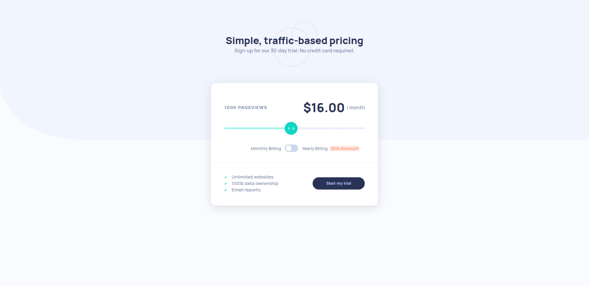

# Interactive Pricing Component

# Description

Thanks for checking out this front-end coding challenge from the [Frontend Mentor](https://www.frontendmentor.io/challenges/interactive-pricing-component-t0m8PIyY8/hub). This component is made with Vue, Scss and BEM methodology. More app previews in src/assets/previews.

## Assets

I used [Monrope](https://fonts.google.com/specimen/Manrope) font family in the following weights:

- SemiBold 600
- ExtraBold 800

Color palette is provided by FrontendMentor. Color names in src/assets/styles/variables.scss.

## Tests

Component was tested in following browsers:

- Brave
- Brave (Android)
- FireFox

# Credits

- Challenge source: [Frontend Mentor](https://www.frontendmentor.io/challenges/interactive-pricing-component-t0m8PIyY8/hub)
- Font Source: [Manrope](https://fonts.google.com/specimen/Manrope?query=manrope)
- Card box-shadow: [GetCssScan](https://getcssscan.com/css-box-shadow-examples)
- Range input: [LogRocket](https://blog.logrocket.com/creating-custom-css-range-slider-javascript-upgrades/)
- Toggle: [AlvaroTrigo blog](https://alvarotrigo.com/blog/toggle-switch-css/)
